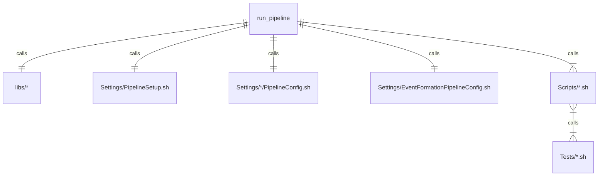

# SuperMuSR Data Pipeline Trace and Event Viewer

## Deployment

### Installation

To deploy the pipeline in a system, do the following:
1. Clone the github repo `STFC-ICD-Research-and-Design/supermusr-data-pipeline` and cd into the directory `supermusr-data-pipeline`.
2. Run `nix develop --command cargo build --release`.
3. Clone the github repo `Modularius/pipeline-test` and cd into `pipeline-test`.

### Setup

1. In file `Settings/PipelineSetup.sh`:

    1. Ensure `APPLICATION_PREFIX` points to the directory containing the component executables.
    2. Ensure `OTEL_ENDPOINT` points to the correct OpenTelemetry connector.

2. Duplicate folders in `Settings/` for each broker you wish to connect to. By default `Settings/Local` is included for if a broker is installed locally. For broker in "location", modify the file `Settings/"location"/PipelineConfig.sh`

    1. Set `BROKER` to point to the kafka broker.
    2. Set `TRACE_TOPIC`, `DAT_EVENT_TOPIC`, etc to the names of the approprate topics on the broker.
    3. Set `DIGITIZERS` to the list of `digitiser_id`s that are handled by the broker (make use of `build_digitiser_argument` if possible).
    4. Set `NEXUS_OUTPUT_PATH` to point to the desired location of the Nexus Writer output. Each broker should have its own folder in `Output`.

3. In the file `Settings/EventFormationConfig.sh` set the [TODO]

## Configuration

Having configured the currently existing shell files the following can be created.

|   |   |
|---|---|
|Docker|Contains `.yaml` and `.env.` files for `docker-compose`|
|Docs|Contains documentation specific to this deployment|
|Jupyter|Python/Jupyter scripts specific to this deployment|
|Scripts|Each file is a shell which runs a specific set of instructions.| 
|Simulations|Contains `.json` files for use by the simulator|
|Tests|Shell files which perform specific tasks, which can be performed by multiple `Scripts/` shells|

## Execution and Exiting

To run call `./run_pipeline.sh`.

To kill the pipeline (though not the simulator) call `./kill.sh`.

To mount the archive, run

```shell
mount -t cifs \
   -o username=SuperMusr_mgr -o password=******** \
   -o domain=ISIS -o vers=2.1 -o noserverino -o _netdev \
   -o uid=****,gid=****,rw,auto,file_mode=0766,dir_mode=0775 \
   //ISISARVR55.isis.cclrc.ac.uk/SuperMusrTestDataBackup$ \
   /mnt/archive
```


altering any parameters as required.

## File Structure

The deployment follows the pattern:
